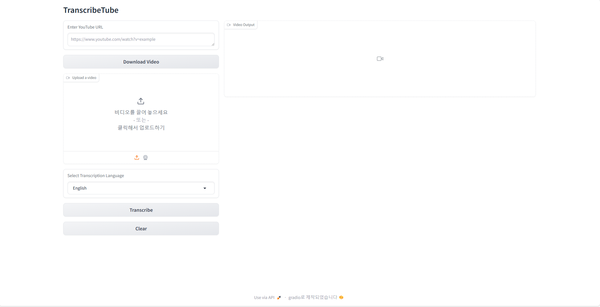

# TranscribeTube

TranscribeTube is a Python-based tool that transcribes and generates subtitles for videos, either from local files or YouTube links, using Hugging Face models for speaker diarization and automatic speech recognition. The tool leverages **Gradio** to provide an easy-to-use, interactive web interface, allowing users to upload videos, choose languages, and download subtitles with just a few clicks.



## Features

- **Interactive Interface with Gradio**: Provides a user-friendly web interface for uploading videos, selecting transcription languages, and downloading results.
- **Supports Local and YouTube Videos**: Easily transcribe videos from your local device or directly from YouTube links by using [yt_dlp](https://github.com/yt-dlp/yt-dlp).
- **Accurate Transcriptions with Hugging Face Models**: Utilizes state-of-the-art models for speaker diarization and automatic speech recognition from Hugging Face.
- **Subtitle Generation**: Generates subtitles in the SRT format, ready to use with your videos.

## Installation

1. **Clone the repository**:

   ```bash
   git clone https://github.com/yourusername/TranscribeTube.git
   cd TranscribeTube
    ```

2. **Install Dependencies**:

   ```bash
    pip install -r requirements.txt
   ```

   **Note**: You need to install PyTorch separately based on your CUDA version for optimal performance, especially if you plan to use GPU acceleration. You can find the correct installation command for your setup on the [PyTorch Get Started Page](https://pytorch.org/get-started/locally/). 

3. **Grant Access to the Hugging Face Model for Speaker Diarization**:

   You need to get access to the [`pyannote/speaker-diarization-3.1`](https://huggingface.co/pyannote/speaker-diarization-3.1) model from Hugging Face. This model cannot be downloaded and loaded from a local path; it must be accessed directly from Hugging Face's servers. Ensure your Hugging Face account has the necessary permissions to use this model.

   ### How to Get Access:

   1. **Create a Hugging Face Account**: If you don't already have one, create an account on [Hugging Face](https://huggingface.co/join).

   2. **Create an API Token**: Generate an API token and set it up according to the instructions provided in the Hugging Face documentation:
      - [Managing Your Tokens](https://huggingface.co/docs/hub/en/security-tokens)
      - [Accessing Private Models](https://huggingface.co/docs/transformers.js/en/guides/private)

   3. **Update Your Configuration**: After obtaining your API token, update the `token` part in your `config.yaml` file with your Hugging Face API token:

   **Note**: For downloading Whisper models or other transcribe models locally, you can use the `download_hf_model.py` script provided in this repository. If you want to download granted models, you need to log in using the Hugging Face CLI. You can follow the instructions in the [Hugging Face CLI Guide](https://huggingface.co/docs/huggingface_hub/en/guides/cli) to set up your authentication. Make sure to update your `config.yaml` file to reflect the paths to your locally downloaded models. 

## Usage

### Running the Transcription Tool

1. **Prepare your configuration**:

   Make sure to set up your `config.yaml` file with the correct paths for models, tokens, and other necessary configurations.

2. **Run the main script**:

   ```bash
   python transcribe_tube.py
   ```

After running the script, you can access the Gradio interface on your local machine by navigating to the following URL: [http://127.0.0.1:7860](http://127.0.0.1:7860) (this is the default Gradio address).

### Using the Gradio Interface:
* **Local Video**: Upload a local video file directly through the Gradio interface.
* **YouTube Video**: Enter a YouTube URL in the interface to download and transcribe the video.
* **Select Language**: Choose the desired transcription language from the dropdown menu. The list of supported languages can be found in the `config.yaml` file, which is configured based on the Whisper-v3 model. This model supports a wide range of languages, ensuring you can accurately transcribe videos in various languages. Make sure to check the `config.yaml` file for the complete list of languages available for transcription.
* **Transcribe**: Click the "Transcribe" button to start the transcription process.
* **Video Output**: Once the transcription is complete, you can play the transcribed video in the output section. The video will display the subtitles generated from the transcription process directly below the video player.
* **Download Results**: After transcription, you can download the transcribed video file and the generated SRT subtitle file displayed below the output video. Alternatively, you can also find these files in the `result` folder within the repository.
* **Clear Outputs**: Use the "Clear" button to reset the interface and remove all related files.

**Note**: If the video file is large, the download and transcription process may take a considerable amount of time. You can monitor the transcription progress displayed in the video output section.

## Demo

### See TranscribeTube in Action

The GIF above demonstrates how easy it is to use TranscribeTube to transcribe and generate subtitles for videos. With just a few clicks, you can upload a video or enter a YouTube URL, select the desired language, and start the transcription process. Watch as the tool processes the video, displays the transcribed subtitles, and provides download options for both the video and subtitle files.


## Contributing

Contributions are welcome! Please submit a pull request or open an issue to discuss your changes or suggestions.
